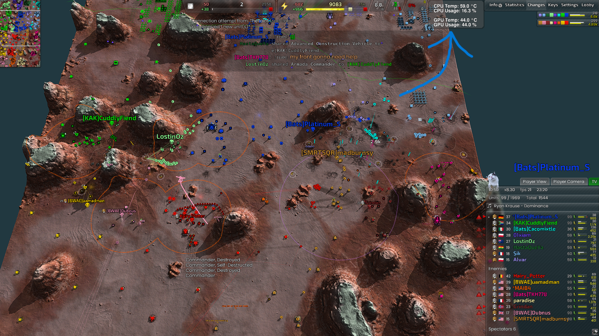

# Open-Stat-Dump 

Open-Stat-Dump is a windows console application that reads hardware and system 
statistics and continuously writes them to JSON and Lua files for other
applications to consume

It is designed to act as a bridge between hardware monitoring software
and other applications, such as GUI widgets, overlays, dashboards, or game interfaces

## Example

Open-Stat-Dump can be used as a data source for applications such as
in-game widgets and overlays

<p>
	
</p>

The widget can be found here
[GUI widget](https://github.com/DeclanFindlay/Open-Stat-Dump-BAR_Widget)

## How it works

Open-Stat-Dump uses LibreHardwareMonitorLib to access hardware information

The program periodically reads the available hardware sensors and writes the
selected statistics to one or more ouput files

Other applications can then read these files and use the data

``` text
Hardware
↓
LibreHardwareMonitorLib
↓
Open-Stat-Dump
↓
JSON / Lua
↓
Other applications
```

## Prerequisites/notes 

Tools:

- visual studio 2022
- .NET Desktop Development workload for C#
- Git

Open-Stat-Dump is windows only 

You will need to build from source to use this program

The Dependency LibreHardwareMonitorLib NuGet package requires elevated privileges on many systems
to access certain hardware sensors, such as CPU temperature and other low-level hardware
your text editor(visual studio) will need elevated privileges also, when running the
.exe from the text editor 

## Dependencies 

Open-Stat-Dump depends on the LibreHardwareMonitorLib NuGet package 
LibreHardwareMonitor is under the License
Mozilla Public License 2.0

You can find LibreHardwareMonitor at
[LibreHardwareMonitor GitHub repository](https://github.com/LibreHardwareMonitor/LibreHardwareMonitor)
you dont need to download this, you will be using the nuget package LibreHardwareMonitorLib 
which will be downloaded from within visual studio, read the next section for that

## How to Download and build Open-Stat-Dump 

To get the Open-Stat-Dump source code run:
```bash
git clone https://github.com/DeclanFindlay/Open-Stat-Dump.git
```
after you run the command locate Open-Stat-Dump.sln

then open the Open-Stat-Dump.sln this will open the visual studio project

then open the visual studio terminal and use this command to get
LibreHardwareMonitorLib NuGet package
```bash
dotnet add package LibreHardwareMonitorLib
```
Visual studio will now have the dependency Open-Stat-Dump needs to build

make sure to set visual studios configurations to x64 and Release or
debug if you are modifying the code 

Once built find, bin\x64\Release\net10.0\Open-Stat-Dump.exe

right click select Run as administrator 

The program should now run

## Functionality 

This program will run in the terminal, you will be prompted to configure settings 
after that it will run and save the system statistics to one or more files

It will continue to update and save the statistics to that file/files based on the 
interval and settings you pick, current file types available
- json
- lua 

>\*\*Note:\*\* make sure to leave the terminal open to continue running 

To end the program just simply close the terminal 

The files will remain after you end the program 

## License 

Open-Stat-Dump is under the MIT License check the License file for more information 
